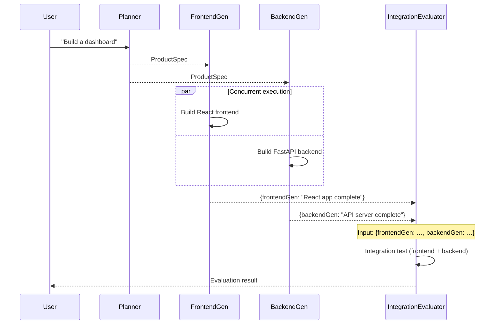

# Use Case Sequence Diagrams

## 1. Simple — Build and Iterate

```typescript
new Pipeline(planner, new Loop(generator, evaluator, { maxRounds: 3 }));
```

Planner creates a spec, then immediately enters the build-evaluate loop. Fast and simple.

```mermaid
sequenceDiagram
    participant U as User
    participant Pl as Planner
    participant G as Generator
    participant E as Evaluator

    U->>Pl: "Build a memo app"
    Pl->>Pl: Expand prompt
    Pl-->>G: ProductSpec (app name, features, tech stack)

    rect rgb(40, 40, 60)
        Note over G,E: Loop Round 1
        G->>G: Build app (React+Vite, FastAPI)
        G-->>E: BuildResult (app dir, port, self-assessment)
        E->>E: API calls + Playwright tests
        E-->>G: QAReport {passed: false, feedback: ["Login broken"]}
    end

    rect rgb(40, 40, 60)
        Note over G,E: Loop Round 2
        G->>G: Apply feedback, fix issues
        G-->>E: BuildResult (updated app)
        E->>E: Retest
        E-->>U: QAReport {passed: true}
    end
```



---

## 2. With Negotiation — Agree Before Building

```typescript
new Pipeline(
  planner,
  new Contract(proposer, reviewer, { maxRounds: 2 }),
  new Loop(generator, evaluator, { maxRounds: 3 }),
);
```

A Contract phase precedes the build to align on what to build and how to test it.

```mermaid
sequenceDiagram
    participant U as User
    participant Pl as Planner
    participant Pr as Proposer
    participant Rv as Reviewer
    participant G as Generator
    participant E as Evaluator

    U->>Pl: "Build a DAW"
    Pl-->>Pr: ProductSpec

    rect rgb(60, 40, 40)
        Note over Pr,Rv: Contract Round 1
        Pr->>Pr: Draft build plan
        Pr-->>Rv: Proposal {feature order, test criteria, architecture}
        Rv->>Rv: Review criteria
        Rv-->>Pr: {accepted: false, feedback: "Feature 3 has no test criteria"}
    end

    rect rgb(60, 40, 40)
        Note over Pr,Rv: Contract Round 2
        Pr->>Pr: Revise plan based on feedback
        Pr-->>Rv: Updated proposal
        Rv->>Rv: Re-review
        Rv-->>G: {accepted: true} → Agreed plan
    end

    rect rgb(40, 40, 60)
        Note over G,E: Loop Round 1
        G->>G: Build against agreed criteria
        G-->>E: BuildResult
        E->>E: Evaluate against agreed criteria
        E-->>G: QAReport {passed: false, feedback: ["DB connection failed"]}
    end

    rect rgb(40, 40, 60)
        Note over G,E: Loop Round 2
        G->>G: Fix issues
        G-->>E: BuildResult
        E-->>U: QAReport {passed: true}
    end
```



---

## 3. Parallel Build — Divide and Evaluate

```typescript
new Pipeline(
  planner,
  new Parallel(frontendGen, backendGen),
  integrationEvaluator,
);
```

Frontend and backend are built concurrently, then evaluated together. Single pass, no iteration.



---

## 4. Parallel Build + Loop — Concurrent Build with Iteration

```typescript
new Pipeline(
  planner,
  new Loop(
    new Parallel(frontendGen, backendGen),
    integrationEvaluator,
    { maxRounds: 3 },
  ),
);
```

Combines Parallel and Loop. Each round builds frontend/backend concurrently, then evaluates together.

```mermaid
sequenceDiagram
    participant U as User
    participant Pl as Planner
    participant FG as FrontendGen
    participant BG as BackendGen
    participant IE as IntegrationEvaluator

    U->>Pl: "Real-time chat app"
    Pl-->>FG: ProductSpec
    Pl-->>BG: ProductSpec

    rect rgb(40, 40, 60)
        Note over FG,IE: Loop Round 1
        par Concurrent build
            FG->>FG: Build frontend
        and
            BG->>BG: Build backend
        end
        FG-->>IE: Frontend result
        BG-->>IE: Backend result
        IE->>IE: Integration test
        IE-->>FG: {passed: false, feedback: ["WebSocket connection failed"]}
    end

    rect rgb(40, 40, 60)
        Note over FG,IE: Loop Round 2
        par Concurrent fix
            FG->>FG: Apply feedback
        and
            BG->>BG: Apply feedback
        end
        FG-->>IE: Updated frontend
        BG-->>IE: Updated backend
        IE-->>U: {passed: true}
    end
```



---

## 5. Sprint — Feature-by-Feature Build

```typescript
new Sprint(
  new Loop(generator, evaluator, { maxRounds: 3 }),
);
```

Decomposes the `sprints` array from input and runs each feature through an independent build-evaluate loop.

```mermaid
sequenceDiagram
    participant U as User
    participant S as Sprint
    participant G as Generator
    participant E as Evaluator

    U->>S: {sprints: [{name: "auth"}, {name: "dashboard"}, {name: "settings"}]}

    rect rgb(40, 60, 40)
        Note over G,E: Sprint 1: auth
        G->>G: Build auth module
        G-->>E: BuildResult
        E-->>G: {passed: false, feedback: ["Token expiry not handled"]}
        G->>G: Fix
        G-->>E: BuildResult
        E-->>S: {passed: true}
    end

    rect rgb(40, 60, 40)
        Note over G,E: Sprint 2: dashboard
        G->>G: Build dashboard
        G-->>E: BuildResult
        E-->>S: {passed: true}
    end

    rect rgb(40, 60, 40)
        Note over G,E: Sprint 3: settings
        G->>G: Build settings page
        G-->>E: BuildResult
        E-->>G: {passed: false, feedback: ["Save button not working"]}
        G->>G: Fix
        G-->>E: BuildResult
        E-->>S: {passed: true}
    end

    S-->>U: {sprintResults: [authResult, dashboardResult, settingsResult]}
```



---

## 6. Full Combo — Negotiate + Decompose + Parallelize + Iterate

```typescript
new Pipeline(
  planner,
  new Contract(proposer, reviewer),
  new Sprint(
    new Loop(
      new Parallel(frontendGen, backendGen),
      integrationEvaluator,
      { maxRounds: 3 },
    ),
  ),
);
```

Maximum configuration combining all patterns: plan negotiation → feature decomposition → parallel build + iterative evaluation per feature.

```mermaid
sequenceDiagram
    participant U as User
    participant Pl as Planner
    participant Pr as Proposer
    participant Rv as Reviewer
    participant S as Sprint
    participant FG as FrontendGen
    participant BG as BackendGen
    participant IE as IntegrationEvaluator

    U->>Pl: "E-commerce platform"
    Pl-->>Pr: ProductSpec

    rect rgb(60, 40, 40)
        Note over Pr,Rv: Contract — Agree on build plan
        Pr-->>Rv: Build proposal
        Rv-->>Pr: {accepted: false, feedback: "Add payment security criteria"}
        Pr-->>Rv: Revised proposal
        Rv-->>S: {accepted: true}
    end

    rect rgb(40, 60, 40)
        Note over S,IE: Sprint 1: Product Catalog
        rect rgb(40, 40, 60)
            Note over FG,IE: Loop Round 1
            par Concurrent build
                FG->>FG: Product listing UI
            and
                BG->>BG: Product API
            end
            IE->>IE: Integration test
            IE-->>FG: {passed: true}
        end
    end

    rect rgb(40, 60, 40)
        Note over S,IE: Sprint 2: Payment System
        rect rgb(40, 40, 60)
            Note over FG,IE: Loop Round 1
            par
                FG->>FG: Payment UI
            and
                BG->>BG: Payment API
            end
            IE-->>FG: {passed: false, feedback: ["Card validation failed"]}
        end
        rect rgb(40, 40, 60)
            Note over FG,IE: Loop Round 2
            par
                FG->>FG: Fix
            and
                BG->>BG: Fix
            end
            IE-->>S: {passed: true}
        end
    end

    S-->>U: {sprintResults: [catalogResult, paymentResult]}
```



---

## Pattern Selection Guide

| Scenario | Recommended Pattern | Why |
|----------|-------------------|-----|
| Simple app, quick results | Simple | Minimal overhead |
| Complex app, need clear criteria | Negotiation | Align on scope before building |
| Independent frontend/backend | Parallel | Time savings |
| Large app, many features | Sprint | Independent per-feature builds |
| Enterprise-grade | Full Combo | Negotiate + decompose + parallelize + iterate |
