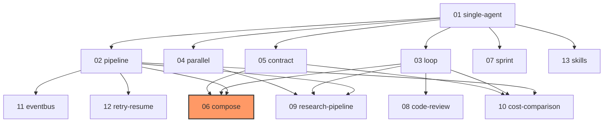

# Circe Examples

Progressive examples for the Circe multi-agent framework. Each example is independently runnable and prints cost/metrics at the end.

## Prerequisites

```bash
export ANTHROPIC_API_KEY=your-key-here
```

## Running

```bash
npx tsx examples/01-single-agent.ts
```

## Estimated Costs

Costs are based on `claude-opus-4-6` default pricing. Each SDK call includes ~11K input tokens of system overhead, so even simple examples cost ~$0.09 per agent call. Actual costs vary by model and response length.

## Examples

| # | Example | Primitives | Difficulty | Est. Cost | Description |
|---|---------|-----------|------------|-----------|-------------|
| 01 | [single-agent](01-single-agent.ts) | Agent | Beginner | ~$0.09 | Hello world — one agent, one task |
| 02 | [pipeline](02-pipeline.ts) | Pipeline | Beginner | ~$0.27 | Sequential chaining with per-step cost |
| 03 | [loop](03-loop.ts) | Loop | Beginner | ~$0.55 | Iterative refinement (GAN pattern) |
| 04 | [parallel](04-parallel.ts) | Parallel | Intermediate | ~$0.18 | Concurrent execution + partial failure |
| 05 | [contract](05-contract.ts) | Contract | Intermediate | ~$0.55 | Adversarial negotiation |
| 06 | [compose](06-compose.ts) | Pipeline+Contract+Loop | Intermediate | ~$1.00 | **Nested primitives — the money shot** |
| 07 | [sprint](07-sprint.ts) | Sprint | Intermediate | ~$0.27 | Batch sequential execution |
| 08 | [code-review](08-code-review.ts) | Loop | Intermediate | ~$0.55 | Real-world GAN: code writer ⇄ reviewer |
| 09 | [research-pipeline](09-research-pipeline.ts) | Parallel+Pipeline+Loop | Advanced | ~$1.50 | Multi-primitive practical workflow |
| 10 | [cost-comparison](10-cost-comparison.ts) | Pipeline, Loop, Contract | Advanced | ~$1.50 | Same task, 3 approaches compared |
| 11 | [eventbus](11-eventbus.ts) | EventBus | Advanced | ~$0.18 | Observability and cost tracking |
| 12 | [retry-resume](12-retry-resume.ts) | RetryPolicy, Pipeline.resume() | Advanced | ~$0.45 | Error recovery + checkpointing |
| 13 | [skills](13-skills.ts) | SkillRegistry | Advanced | ~$0.09 | Prompt injection + on-demand loading |

**Total estimated cost to run all examples: ~$7**

## Learning Path



Start with **01** to understand the basics, then explore primitives (**02-05, 07**). Example **06** is the key insight — composability. Practical scenarios (**08-10**) show real-world usage. Infrastructure examples (**11-13**) add observability, resilience, and extensibility.
